<h1>SQL Scripts Explorer</h1>

Microsoft SQL Server Management Studio 18 extension to open, create, edit, organize, search and share SQL Scripts. Its purpose is to allow quick access to scripts that are frequently used.

<h2>Contents</h2>
<ul>
	<li><a href="#getting-started">Getting Started</a>
		<ul>
			<li><a href="#requirements">Requirements</a></li>
			<li><a href="#installation">Installation</a></li>
			<li><a href="#launch">Launch</a></li>
		</ul>
	</li>
	<li><a href="#features">Features</a>
		<ul>
			<li><a href="#manage-multiple-sql-scripts-repositories">Manage multiple SQL Scripts repositories</a></li>
			<li><a href="#organize-sql-scripts-using-folders">Organize SQL Scripts using folders</a></li>
			<li><a href="#open-create-and-edit-sql-script-files">Open, create and edit SQL Script files</a></li>
			<li><a href="#search-sql-scripts-across-repositories">Search SQL Scripts across repositories</a></li>
			<li><a href="#format-sql-scripts">Format SQL Scripts</a></li>
		</ul>
	</li>
	<li><a href="#contributing">Contributing</a>
		<ul>
			<li><a href="#debugging">Debugging</a></li>
		</ul>
	</li>
	<li><a href="#known-issues">Known Issues</a>
		<ul>
			<li><a href="#extension-does-not-load">Extension does not Load</a></li>
			<li><a href="#docking-issue">Docking Issue</a></li>
		</ul>
	</li>
</ul>

<!-- GETTING STARTED -->
<h1>Getting Started</h1>

<h2>Requirements</h2>
<ul>
	<li>Microsoft SQL Server Management Studio 18 (<i>not tested in previous versions</i>)</li>
	<li>.NET 4.7.2</li>
</ul>
<h2>Installation</h2>
<ul>
	<li>Close all instances of Microsoft SQL Server Management Studio 18</li>
	<li>Download the most recent <a href="https://github.com/joaoribe/SQLScriptsExplorer/releases/latest">release</a></li>
	<li>Add release folder <i>SQLScriptsExplorer</i> to
		 
		<code>C:\Program Files (x86)\Microsoft SQL Server Management Studio 18\Common7\IDE\Extensions</code>
		 
		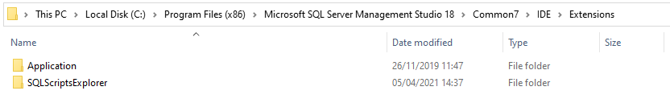
	</li>
</ul>
<h2>Launch</h2>

You can access the addin via the View menu.

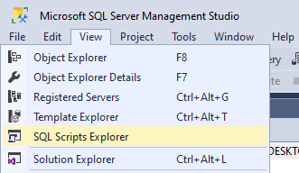

Or you can add a quick launch button by enabling the toolbar.

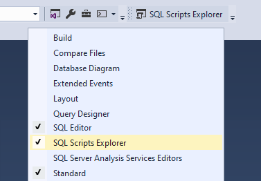

<!-- FEATURES -->
<h1>Features</h1>

<h2>Manage multiple SQL Scripts repositories</h2>

Map local folders to store your own SQL Scripts or collaborate/share knowledge with your team by mapping shared SQL Scripts folders.

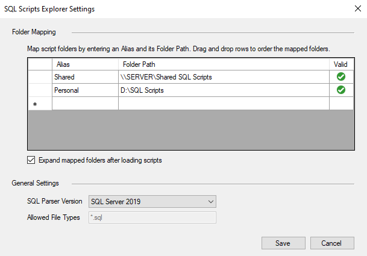

<h2>Organize SQL Scripts using folders</h2>

Use the explorer to organize scripts using folders.

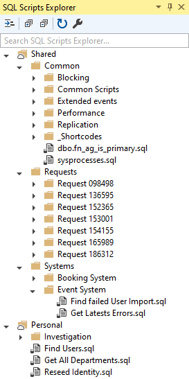

<h2>Open, create and edit SQL Script files</h2>

Use the explorer to manage your scripts without living your worksapce.

<h2>Search SQL Scripts across repositories</h2>

Easily search SQL Scripts across different mapped repositories.

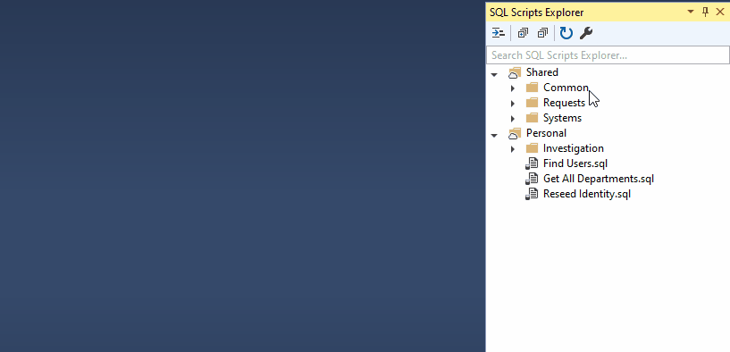

<h2>Format SQL Scripts</h2>

Use <i>Format Selection</i> button to format SQL statements.

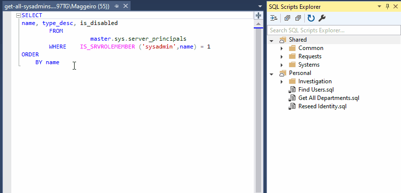

<!-- CONTRIBUTING -->
<h1>Contributing</h1>

Feel free to report an issue or suggest a feature. If you would like to introduce a functionality or fix an issue, please create a pull request.

<h2>Debugging</h2>
<ul>
	<li>Install Visual Studio 2019 with <i>Visual Studio Extension Development</i> enabled
		 
		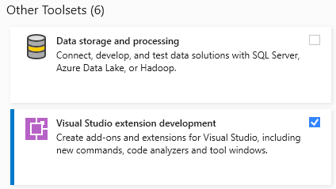
	</li>
	<li>Open solution in Visual Studio 2019 in Administrator Mode</li>
	<li>Right click the project <i>SQLScriptsExplorer.Addin</i></li>
	<li>Select <i>Debug</i> tab</li>
	<ul>
		<li>In the <i>Start external program</i> option, change it to
			 
			<code>C:\Program Files (x86)\Microsoft SQL Server Management Studio 18\Common7\IDE\ssms.exe</code>
		</li>
		<li>In the <i>Command line arguments</i> option, remove all the text
			 
			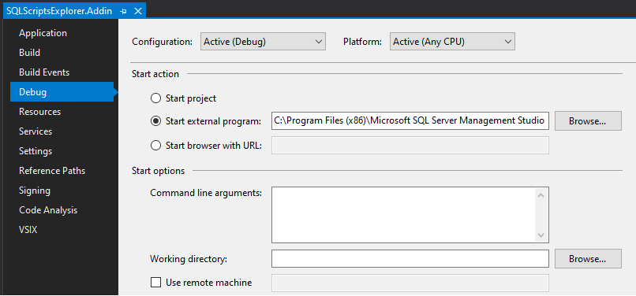
		</li>
	</ul>
	<li>Select <i>VSIX</i> tab
		<ul>
			<li>Ensure <i>Copy VSIX content to the following location</i> is
				 
				<code>C:\Program Files (x86)\Microsoft SQL Server Management Studio 18\Common7\IDE\Extensions\SQLScriptsExplorer</code>
				 
				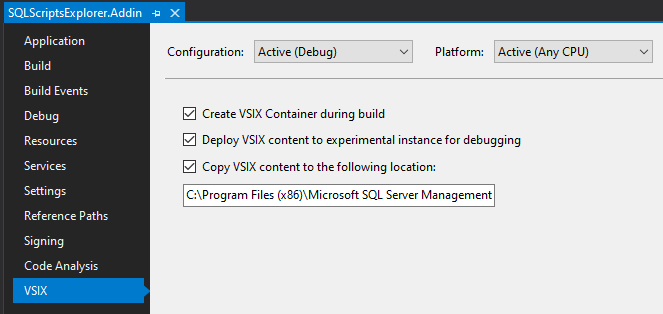
			</li>
		</ul>
	</li>
</ul>

<!-- KNOWN ISSUES -->
<h1>Known Issues</h1>
<h2>Extension does not Load</h2>

Sometimes when you download the release zip file, Windows blocks it for security reasons. If you get an error after the plugin installation or the plugin does not appear in Microsoft SQL Server Management Studio 18, ensure the release ZIP file you have downloaded is unblocked.

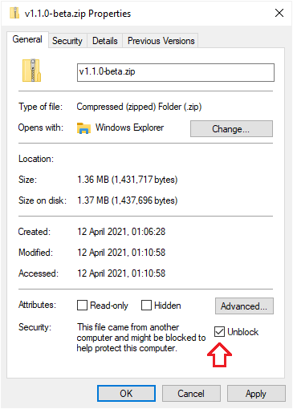

<h2>Docking Issue</h2>

<b>Note:</b> Issue is related to Windows and .NET Framework, not the addin.

There's an issue with docking any Toolbar in Microsoft SQL Server Management Studio 18. Here are two options to solve it:

<ul>
	<li>
		<a target="_blank" href="https://support.microsoft.com/en-us/topic/february-9-2021-kb4601060-cumulative-update-for-net-framework-3-5-and-4-7-2-for-windows-10-version-1809-and-windows-server-version-2019-b240d07e-639f-d708-98c9-0cbe443176aa">
			Install Microsoft's official cumulative update
		</a>
	</li>
	<li>
		Manual fix by changing SSMS.config file. (Source: <a target="_blank" href="https://docs.microsoft.com/en-us/answers/questions/263738/ssms-188-crashes-when-re-docking-tabs.html">Microsoft Docs Q&A</a>)
		<ul>
			<li>Navigate to <i>C:\Program Files (x86)\Microsoft SQL Server Management Studio 18\Common7\IDE</i></li>
			<li>Find "Ssms.exe.config" file, open up a Notepad in Administrator Mode, and edit this file</li>
			<li>You will then need to find an xml tag called &lt;AppContextSwitchOverrides&gt;, and APPEND (not replace) the following exactly:</li>
			<ul>
				<li>
					;Switch.System.Windows.Interop.MouseInput.OptOutOfMoveToChromedWindowFix=true; Switch.System.Windows.Interop.MouseInput.DoNotOptOutOfMoveToChromedWindowFix=true
				</li>
			<ul>
		</ul>
	</li>
</ul>
